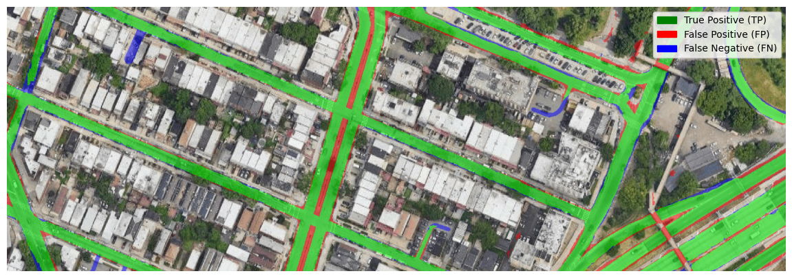
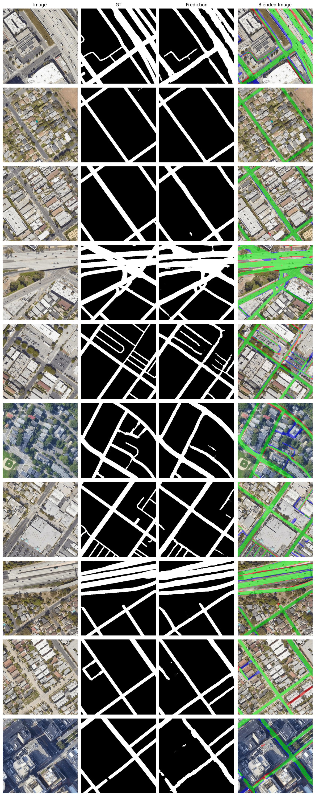

# ETHZ - Computational Intelligence Lab 2024 - Road Segmentation Project


- [ETHZ - Computational Intelligence Lab 2024 - Road Segmentation Project](#ethz---computational-intelligence-lab-2024---road-segmentation-project)
  - [Team](#team)
  - [Project Description](#project-description)
  - [Running the Experiments](#running-the-experiments)
  - [Final Submission](#final-submission)
  - [More Examples](#more-examples)
## Team 
-  **Jannek Ulm** (https://github.com/janulm)
-  **Douglas Orisini-Rosenberg** (https://github.com/duxirosenberg)
- **Raoul van Doren** 
- **Paul Ellsiepen**

## Project Description

The project is based on the Kaggle competition "Road Segmentation" (https://www.kaggle.com/competitions/ethz-cil-road-segmentation-2024). The dataset consists of 144 satellite images of size 400x400 pixels, with corresponding ground truth labels. We expand the dataset with 12k further images and masks using the Google Maps API. The goal is to predict the road segmentation of the images. For evaluation the images are split into 16x16 patches and F1-Score is reported. 

We extend ideas and models from cutting-edge vision transformers to present BiSeSAM - an efficient and novel road segmentation model. BiSeSAM embeds and extracts the generalized power of Meta's Segment Anything (SAM) image encoder in a custom architecture, with several plug-in decoders. Trained with our manually generated dataset, BiSeSAM achieves on-par performance with state-of-the-art models, and out-performs them in some configurations. 

We ranked P2 (of 19 teams) in the kaggle competition. Please check out our [report](BiSeSAM.pdf) for more details on our approach and BiSeSAM.

Here is a sample prediction of our MLP-BiSeSAM on the test set:


## Running the Experiments 

If you want to run the code, please follow the instructions below. First one needs to install the required packages. This can be done by running the following command in the terminal:

1.  Installing the required packages
Note that this requires a machine with CUDA support, since some code makes use of CUDA proprieatry optimizations such as TF32 and torch.compile(). 

```bash
conda env create -f cuda_environment.yml
conda activate cil-road
```

2. Downloading SAM checkpoints
Furthermore, the SAM model checkpoints need to be downloaded from the following link: https://dl.fbaipublicfiles.com/segment_anything/sam_vit_h_4b8939.pth and saved in the [checkpoints](custom_segment_anything/model_checkpoints) folder.

3. Downloading the google maps data, by simply running the jupyter notebook [generate_data.ipynb](data/generate_data.ipynb). This will download the satellite images and their corresponding masks and save it in the `data` folder. Please note that a (free) google maps API key is required for this step. Furthermore it is also necessary to download the [original dataset](https://www.kaggle.com/competitions/ethz-cil-road-segmentation-2024/data) from the kaggle competition page and save it in the `data\original` folder.

4. Running the experiments:
   1. To train the BiSeSAM model and generate the submissions, please run the jupyter notebook [train_bisesam.ipynb](train_bisesam.ipynb). This will train the model and save the best model checkpoint in the [checkpoints](custom_segment_anything/model_checkpoints/finetuned/) folder.    
   2. To train the Unet, Unet++ baseline models and generate their submissions, please run the jupyter notebook [train_baseline.ipynb](train_baseline.ipynb).


## Final Submission

(Note that this section requires that each of the previous steps have been run successfully, to generate the intermediate submissions of each model)

To generate our best scoring and final kaggle submission, please run the jupyter notebook [final_submission.ipynb](final_submission.ipynb). This will generate the submission file `majority_vote_ensemble_all_models.csv` in the root directory.

## More Examples




